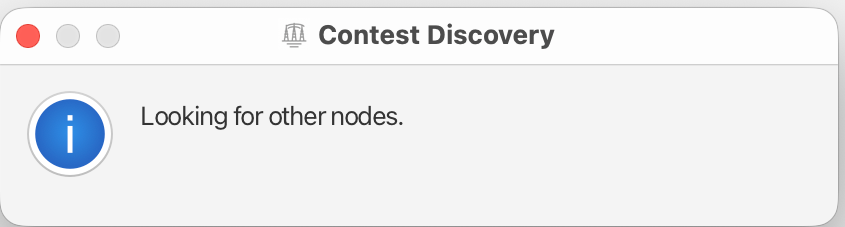
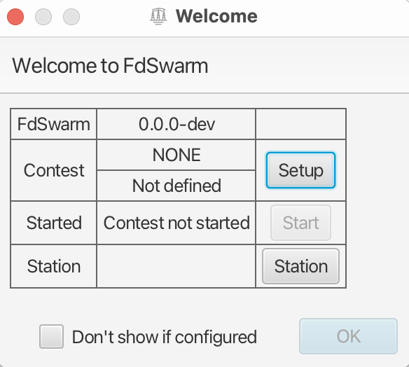
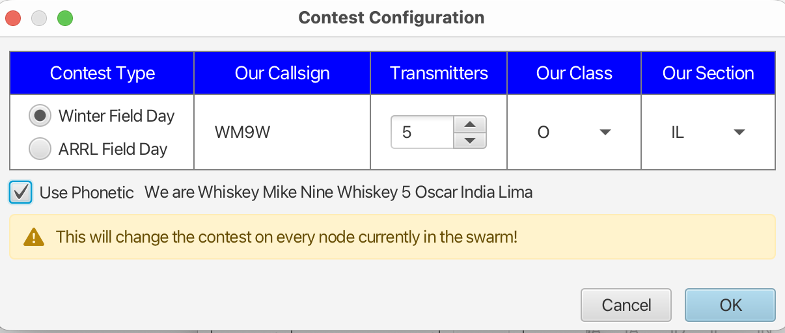
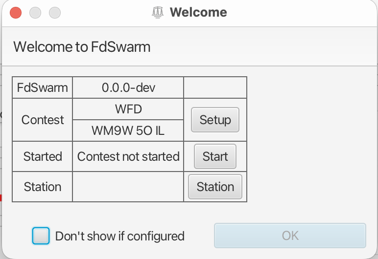
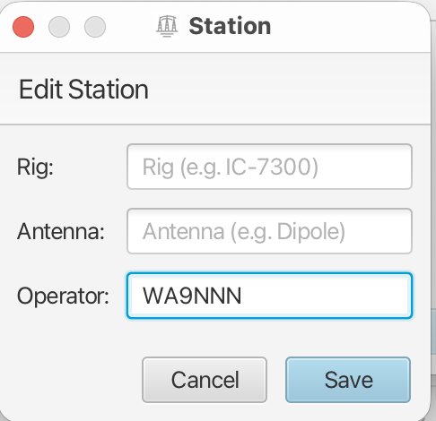

# Startup & Configuration

If FdSwarm is not configured, it will try to find another node on the network that is running and configured. When this
happens, a discovery message will be displayed:

If aleady configured FdSwarm will go right the the Welcome Dialog
This usually takes a few seconds. If another node is found FdSwarm will use the Callsign, Contest Class and Section.

Next will be the Welcome dialog.

If no configuration was discovered, or it's not yet set up; use the Setup button to configure contest.

This lets you set the five pieces of information needed:

| Field        | Purpose                                                 |
|--------------|---------------------------------------------------------|
| Contest Type | Select the contest to use.                              |
| Our Callsign | Enter the station callsign.                             |
| Transmitters | Set the number of transmitters.                         |
| Our Class    | Select the contest class. Varies with ARRL or WFD.      |
| Our Section  | Select the operating section. Same for both field days. |

Now with the contest defined the Start button will be enabled. 

The start button will tell all the nodes that you are starting to participate in the contest. What this really means is any existing QSOs, e.g. older than now will be deleted.
This lets you partice using FdSwarm before the you've actially started to participate.

The station lets you set who is operating this node.

Only the Operator field is needed. It will be used to report who the operators were for contest submission.
The other fields are optional and can be left blank. These may be of iterest for post-mortem analysis of what worked well.

The Station information can be eaisly changed anytime later from the main screen.

Once the Contest is configured and started, the Ok button will be enabled. Clicking it will let you start entring QSOs.

Once things a are going you may not want to be bothered with the Welcome dialog anymore. 
Just click the "Don't show if configured box". You can turn it back on from the Config -> User menu.
